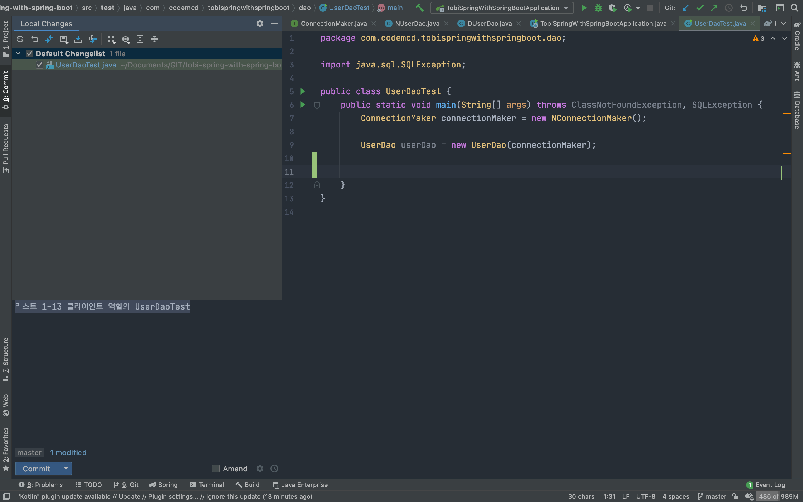
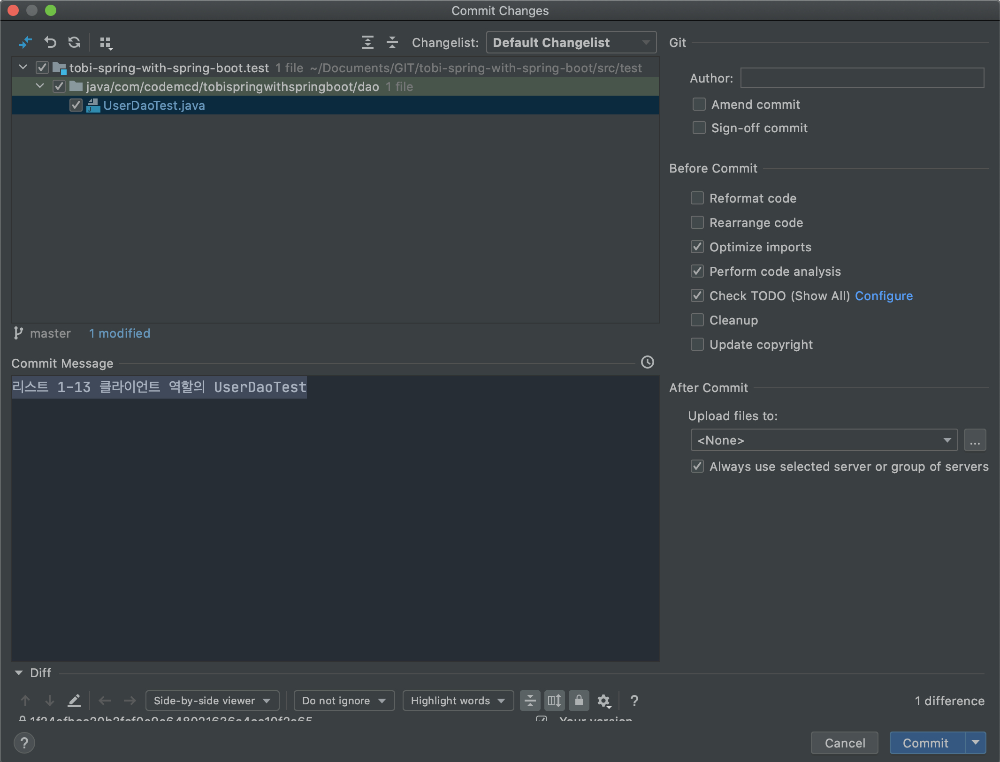
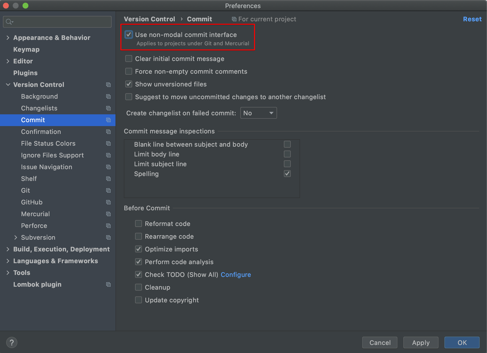

# IntelliJ
> 인텔리제이를 사용하면서 겪은 문제 및 해결 방법

## Contents
## Commit Interface 설정
### 상황
인텔리제이 버전 2020.1 부터 non-model commit interface가 디폴트로 활성화되어 있다. 평소와 다른 인터페이스였고, 몇 번 사용해보니 더 불편해서 기존의 interface로 돌아가고 싶었다.

불편했던 점은
- 디렉토리 구조를 통합해서 보여주는 점
- 변경된 파일을 클릭했을 때 새로운 팝업창이 기존 코드와 같은 탭에 보여주는 점

#### non-model commit interface

#### 기존 commit interface

### 해결방법
Preferences -> Version Control -> Commit -> Use non-model commit interface 체크박스 해제

#### Reference
 - <https://www.jetbrains.com/help/idea/commit-changes-dialog.html>

## build 시 OOM(Out Of Memory) 또는 GC overhead limit exceeded 발생시

### 상황
Spring Framework 프로젝트를 IntelliJ에서 빌드할 때 OOM 또는 GC overhead limit exceeded, heap size 초과 등 메모리 초과 관련 에러가 발생한 상황

### 해결방법
가장 간단한 방법은 IntelliJ 설정 중 빌드 heap 크기를 늘린다.

Preferences -> Build, Execution, Deployment -> Complier

위 그림에서 Build process heap size(빨간 네모) 옆에 숫자를 더 큰 크기로 늘린다.

주의할 점은 기본 설정이 다시 빌드할 때 초기 값으로 초기화되는 듯 하다.